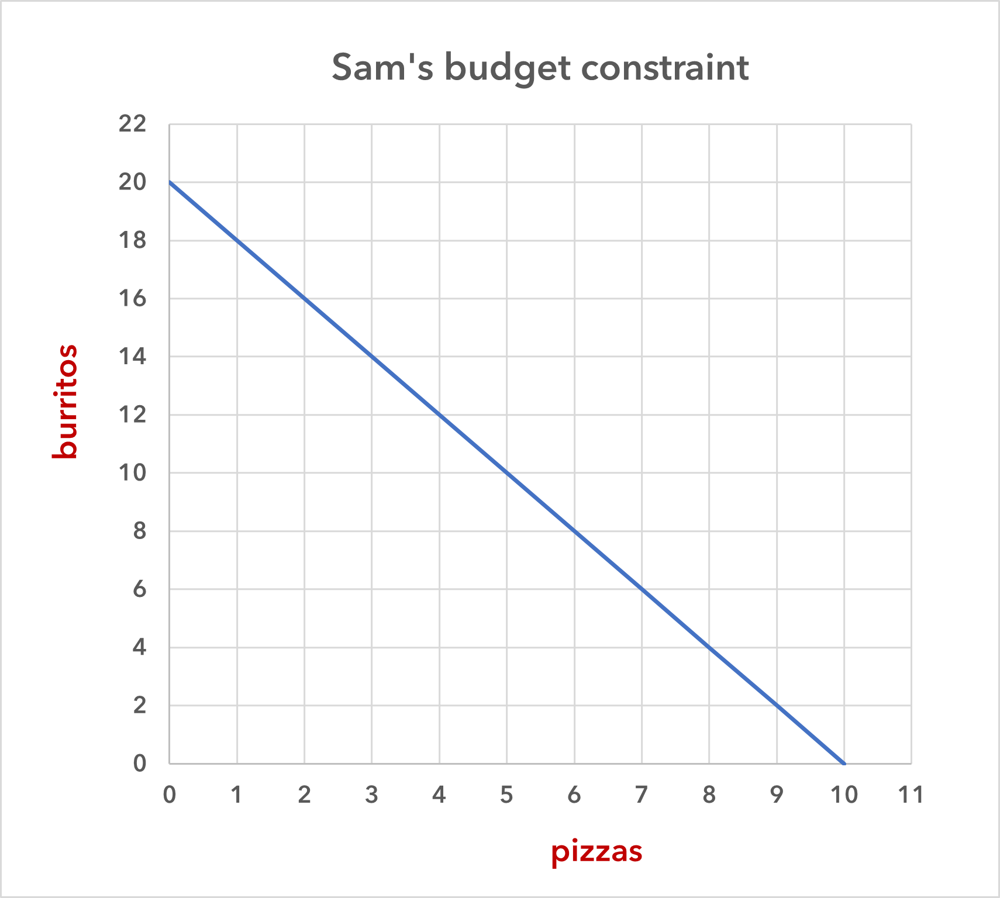
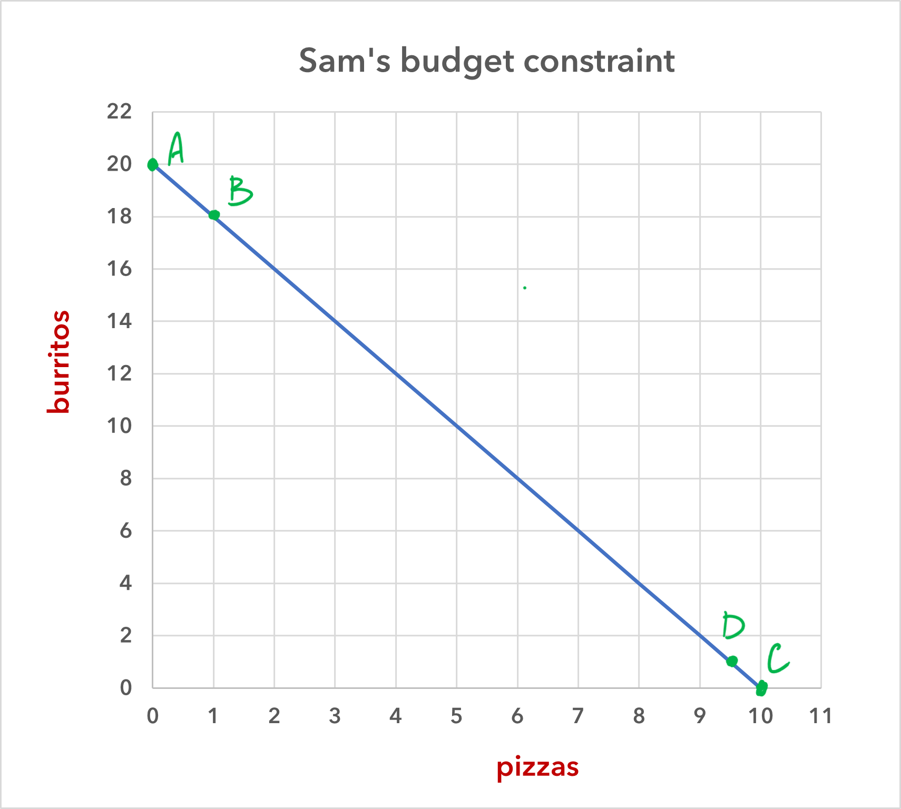

Choices involve trade-offs, and every choice has a cost. The English economist Lionel Robbins (1898--1984), in his *Essay on the Nature and Significance of Economic Science* in 1932, described the fact that we must make trade-offs this way:

!!! note ""

    The time at our disposal is limited. There are only twenty-four hours in the day. We have to choose between the different uses to which they may be put. \... Everywhere we turn, if we choose one thing we must relinquish others which, in different circumstances, we would wish not to have relinquished. Scarcity of means to satisfy given ends is an almost ubiquitous condition of human nature.

Because people live in a world of scarcity, they cannot have all the time, money, possessions, and experiences they wish.

This section will continue our discussion of scarcity and the economic way of thinking by first introducing the budget constraint and then revisiting a concept, introduced in the previous section: *opportunity costs*.

## Choices among two goods

As you will see in this section and in the sections on the production possibilities frontier, we treat economic agents---in these cases, individuals and countries---as if all of their decisions about which goods to consume (or to produce and consume) involved only two goods. In some cases this is realistic, but in many cases it is not. Individuals, and even more so societies, choose goods in many different combinations, and usually the choices are not between just two options. 

Focusing on just two goods, however, lets us create the standard two-dimensional graphs to illustrate and investigate the budget constraint and the production possibilities frontier. But don't worry. These concepts can be applied to real world situations that involve more than just two goods at a time. If you like, you can ponder how a budget constraint or a production possibilities frontier for three goods would appear on a three-dimensional graph. If we wanted to investigated how trade-offs are made for more than three goods, then we would have to give up graphing and carry out our analysis using math or a computer program. 

## The budget constraint

Consider the typical consumer's budget problem. Let's say that Sam has a weekly income of \$100, and he spends it all on two types of food: burritos, which cost \$5 each, and pizza, which costs \$10 each. (He has no other money, and he can't save the money that he doesn't spend.) This gives Sam the options that are shown in table 1.

<table class="styled-table">
<thead>
<tr>
<th>burritos ($5)</th>
<th>pizza ($10)</th>
<th>total spending</th>
</tr>
</thead>
<tbody>
<tr>
<td>20</td>
<td>0</td>
<td>$100</td>
</tr>
<tr>
<td>18</td>
<td>1</td>
<td>$100</td>
</tr>
<tr>
<td>16</td>
<td>2</td>
<td>$100</td>
</tr>
<tr>
<td>14</td>
<td>3</td>
<td>$100</td>
</tr>
<tr>
<td>12</td>
<td>4</td>
<td>$100</td>
</tr>
<tr>
<td>10</td>
<td>5</td>
<td>$100</td>
</tr>
<tr>
<td>8</td>
<td>6</td>
<td>$100</td>
</tr>
<tr>
<td>6</td>
<td>7</td>
<td>$100</td>
</tr>
<tr>
<td>4</td>
<td>8</td>
<td>$100</td>
</tr>
<tr>
<td>2</td>
<td>9</td>
<td>$100</td>
</tr>
<tr>
<td>0</td>
<td>10</td>
<td>$100</td>
</tr>
</tbody>
<caption>Table 1</caption>
</table>

And we can graph these different opportunities as is shown in figure 1.

{width="80%"}

<strong>Figure 1</strong>

This line in the graph is Sam's **budget constraint**. It represents all possible combinations of the two goods that he can afford, given his income and the price of the goods.

Sam can choose any of the combinations of goods that are either on the line or to the left of it (that is, inside the constraint, so to speak). We note the following features of the budget constraint.

1. If Sam chooses a combination of pizza and burritos that is inside his budget constraint, then he is wasting money by not consuming more of one or the other of the goods (or more of both).

2. Sam cannot consume a combination of these two goods that is outside of (i.e., to the right of) his budget constraint, given his \$100 budget.

3. Sam can consume any combination of pizza and burritos that is on his budget constraint, and no combination is better or worse than any other. But because of the law of diminishing marginal utility, most people will want some of both goods. In most cases, most people will eventually reach a point where an additional unit of even the preferred good is going to bring less satisfaction (utility, happiness) than a unit of the other good.

4. Sam's budget constraint will shift to the right if either (*a*) Sam's income increases or (*b*) the price of either or both goods decreases. (So, therefore, (*a*) and (*b*) are functionally equivalent: an increase in income is the same as a decrease in prices.)

5. Sam's budget constraint will shift to the left if either (*a*) Sam's income decreases or (*b*) the price of either or both goods increases. (So, therefore, again, (*a*) and (*b*) are functionally equivalent: a decrease in income is the same as a increase in prices.)

## Sam's opportunity cost

Recall the definition of **opportunity cost**: a decision's opportunity cost is the value of the next best alternative or what the individual gives up when he or she makes a decision.

When Sam buys a pizza, he is giving up the chance to have some number of burritos, and likewise, when he buys a burrito, he is giving up the chance to have some number of pizzas (or, in this case, some portion of a pizza). Hence, each choice that he makes has an opportunity cost. These opportunity costs are easy to find by looking at the graph in figure 2.

{width="80%"}

<strong>Figure 2</strong>

We'll start with the opportunity cost of buying a pizza. It doesn't matter which point we pick on the horizontal axis, but let's start with point A on the budget constraint. If Sam selects this combination, he will have 20 burritos and zero pizzas. So, if he switches from zero to one pizza---which will take him to point B on the budget constraint---how many burritos does he give up? He gives up two. That is, he goes from having 20 burritos to having 18.

Next, we do the same for burritos. If Sam buys zero burritos, then he can have 10 pizzas. This is point C. If Sam switches from zero burritos to 1 (which will take him to point D), how many pizzas does he give up? He gives up ½ of a pizza. That is, he goes from having 10 pizzas to have 9.5. These, then, are Sam's opportunity costs:

!!! note ""

    The opportunity cost of buying a pizza is 2 burritos.
    
	The opportunity cost of buying a burring is .5 pizzas.

<iframe width="560" height="315" src="https://www.youtube-nocookie.com/embed/m5ABIikb_D8?si=kgqhZhrbb6NjoZrE" title="YouTube video player" frameborder="0" allow="accelerometer; autoplay; clipboard-write; encrypted-media; gyroscope; picture-in-picture; web-share" allowfullscreen></iframe>

<strong>Video 1</strong>

