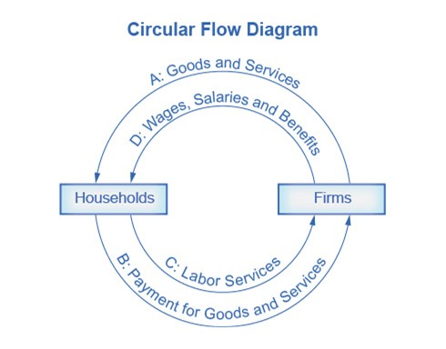
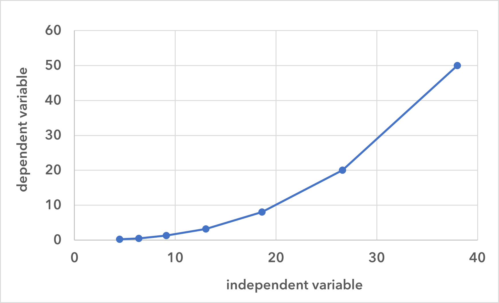
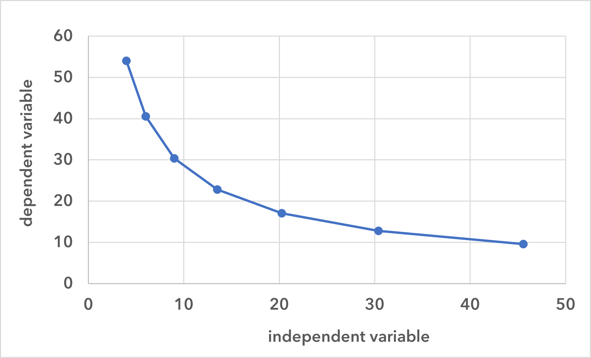
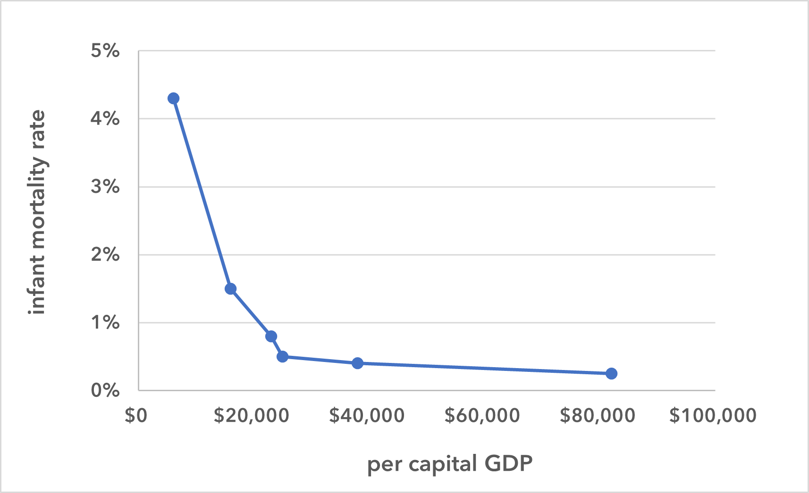

This section and the next one cover important economic concepts and tools (the latter being models and graphing). This will, in part, introduce you to what economics is and how we pursue its study.  

## What is economics?

*Economics* is the study of how humans make choices under conditions of scarcity. *Scarcity*, in this context, means that people want more of---and would, if possible, consume more of---a good, service, or resource than is available. So, this isn't scarce in the way that we typically use the term. The good, service, or resource might seem quite plentiful, but, nonetheless, everyone cannot have as much of it as they want.

Beef, for example, in the United States, is plentiful, but it's still "scarce" in the economic sense. There's not an unlimited supply and people make trade-offs to get it. So, what isn't scarce? Breathable air, at least for the time being, is not scarce. (Which is not to say that 'clean air' isn't scarce.) A computer program that can be copied and used for free is not scarce. Seawater, although there is, technically a limited quantity, is also not scarce in the economic sense.

A central issue of economics, then, is how to turn resources (which are limited and scarce) into goods and services (which are, therefore, also limited and scarce). This problem of scarcity raises these kinds of questions:

!!! note ""

    How do we turn resources into goods and services?
	
    Which resources do we want to turn into goods and services?
     
    How are we going to distribute those goods and services?

Since these are the kinds of questions with which economics is concerned, economics is really a decision science.

## Resources

There are four categories of resources: land, labor, capital, and entrepreneurship. As just mentioned, all of these are limited and scarce---i.e., there is a finite amount of them, and people would use more of them if more was available.

1. **Land** includes all natural resources: land itself---forests and arable land (i.e., land where crops can be grown)---as well as, for instance, minerals, water, and energy resources.

2. **Labor** is the resource that is provided (or is providable) by workers. Whereas natural resources are one type of input needed to produce goods, labor is another required input.

3. **Capital**, in economics, are the resources that are (*a*) made, (*b*) facilitate the production of goods and services, and (*c*) are not used up shortly after being produced. So, for example, *factories*, *equipment*, and *distribution networks* are types of capital.

4. **Entrepreneurship** is the ability to combine land, labor, and capital to produce goods and services. This is not just entrepreneurship in the everyday sense of the word---i.e., some people's ability to start new businesses. Instead, it is the ability of any person, group, or institution to combine land, labor, and capital in productive ways.

## Factor payments

When producing goods and services, land, labor, capital, and entrepreneurship are the *inputs* or *factors of production*. *Factor payments* are the payments made to use each type of factor. For land the payment is rent, for labor it is wages, for capital it is interest, and for entrepreneurship it is profit. The more alternative uses a resource has, the higher the factor payments will be. The fewer the alternative uses, the lower the factor payments will be. So, for example, the more options a person has for his or her labor, the higher will be his or her wage.

## Goods

*Goods* in economics are those things that are scarce, desirable, and wanted in quantities beyond what is available. For example, houses, books, clothes, clean drinking water, leisure time (non-tangible goods also count) are all goods. In contrast are things that we don't want: for example, pollution or crime. (Although some things may be wanted by some people and not by others---e.g., certain kinds of meat as food \[from cows, or from pigs, or from whales\] or meat in general.)

## Economic models

To help understand the economy, economists often create models. A model is a simplified representation of something, in this case, the economy. One very simple model of the economy is the **circular flow diagram**. In this model, the economy consists of two groups, *households* and *firms*, and they interact in two markets: the goods and services market and the labor market. In the first market, firms sell goods and services to households (which buy the goods and services). In the second, households sell labor to firms (and the firms buy the labor).

{width="60%"}

<strong>Figure 1: The Circular Flow Diagram</strong>&ensp; The circular flow diagram shows how households and firms interact in the (1) goods and services market and (2) labor market. The direction of the arrows indicate that, in the goods and services market, households receive goods & services and pay firms for them (arrows A and B). Meanwhile, in the labor market, households provide labor and receive wages, salaries, and benefits as payment from firms (arrows C and D).

In actuality, there are many different markets for goods and services, and markets for many different types of labor. The circular flow diagram simplifies this to make the description of the economy easier to grasp. Nonetheless, this model has enough features to illustrate how production and labor interact. And we can [add details](https://www.rba.gov.au/education/resources/illustrators/pdf/circular-flow-model.pdf) to this basic model if we want to introduce more real-world elements, such as financial markets, governments, or trade with other countries.

## Graphing

Graphing is super-duper important in economics, and it doesn't ever go away. When you are making graphs yourself, it helps to make them large, to use multiple colors, and, if a graph will be seen by others, to make a draft and then a neater, final version.

Most of the graphs that you will encounter in this course will be line graphs, which represent the relationship between two variables: the *independent variable* and the *dependent variable*.

!!! note ""

    **the independent variable:** The value of this variable is not dependent on the value of the other values being studied. Usually, this variable is on the horizontal axis of the graph, although not always in economics.
    
    **the dependent variable**: The value of this variable *depends on* the value of the independent variable. Usually, this variable is on the vertical axis, although, again, not always in economics.

The relationship between the two variables can be positive, negative, or complex.

!!! note ""

    **A positive relationship** exists when it is the case that, as the value of the independent variable increases, the value of the dependent variable also increases. On a graph, when there is a positive relationship between the variables, the line will have a positive slope.
    
    **A negative relationship** exists when it is the case that, as the value of the independent variable increases, the value of the dependent variable decreases. On a graph, when there is a negative relationship between the variables, the line has a negative slope.
    
    **A complex relationship** exists when the relationship between the variables has both positive and negative components.

{width="48%"} {width="48%"}

<strong>Figures 2 & 3</strong>&ensp; The two variables in the graph on the left are positively related, and so the slope of the line is positive. The two variables in the graph on the right are negatively related, and so the line has a negative slope.

Here is a set of data. The variables are *infant mortality rate* and *per capita GDP*.

<table class="styled-table">
<thead>
	<tr>
		<th>infant mortality rate</th>
		<th>per capita GDP</th>
		<th></th>
	</tr>
</thead>
<tbody>
	<tr>
		<td>4.3 %</td>
		<td>$6,100</td>
		<td>(India)</td>
	</tr>
<tr>
<td>1.5 %</td>
<td>$16,000</td>
<td>(Mexico)</td>
</tr>
<tr>
<td>.80 %</td>
<td>$23,000</td>
<td>(Russia)</td>
</tr>
<tr>
<td>.50 %</td>
<td>$25,000</td>
<td>(Poland)</td>
</tr>
<tr>
<td>.40 %</td>
<td>$38,000</td>
<td>(Belgium)</td>
</tr>
<tr>
<td>.25 %</td>
<td>$82,000</td>
<td>(Norway)</td>
</tr>
</tbody>
</table>

<strong>Table 1</strong>

The independent variable is *per capital GDP*, and as we can see, as the value of this variable increases, the value of the dependent variable, *infant mortality rate*, decreases. Hence, there is a negative relationship between the two variables. This relationship is illustrated in the graph in figure 4.

{width="60%"}

<strong>Figure 4</strong>

Now, let's look at a graph from the [Federal Reserve Economic Data](https://fred.stlouisfed.org/) (FRED) website. We will use this site throughout the course, and so you should familiarize yourself with it. If you go to the site, you can find the graph in figure 5 by putting "gdp" in the search field, and then selecting "Gross Domestic Product."

<iframe src="https://fred.stlouisfed.org/graph/graph-landing.php?g=1dAWV&width=670&height=475" scrolling="no" frameborder="0" style="overflow:hidden; width:670px; height:525px;" allowTransparency="true" loading="lazy"></iframe>

<strong>Figure 5: U.S. nominal GDP</strong>&ensp; You can probably find the interruption to GDP caused by the covid pandemic. The decline in GDP ten years before the covid pandemic was caused by the 2007 - 2008 financial crisis.

Figure 5 is a graph of **nominal GDP**. The years from 1947 to the present are on the horizontal axis. 
The vertical axis is given in billions of dollars. This means that 1 (which isn't labeled on the axis) is \$1 billion. 4,000, the first value on the axis, is \$4,000 billion or \$4,000,000,000,000, which is \$4 trillion. The last reported figure, therefore, will be some number over \$28,000,000,000,000 (depending on when you are looking at this). 

Looking at numbers in billions of dollars is probably unfamiliar to you, but try to remember that the GDP of the United States---the highest GDP in the world---is not \$27,000 or \$28,000 or \$29,000. It's \$27 or \$28 or \$29 trillion (again, depending on when you are looking at this).

