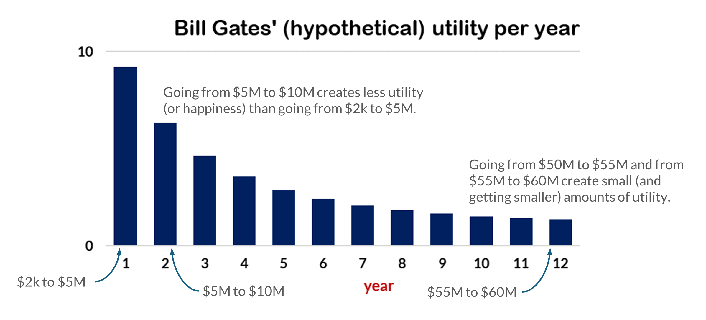
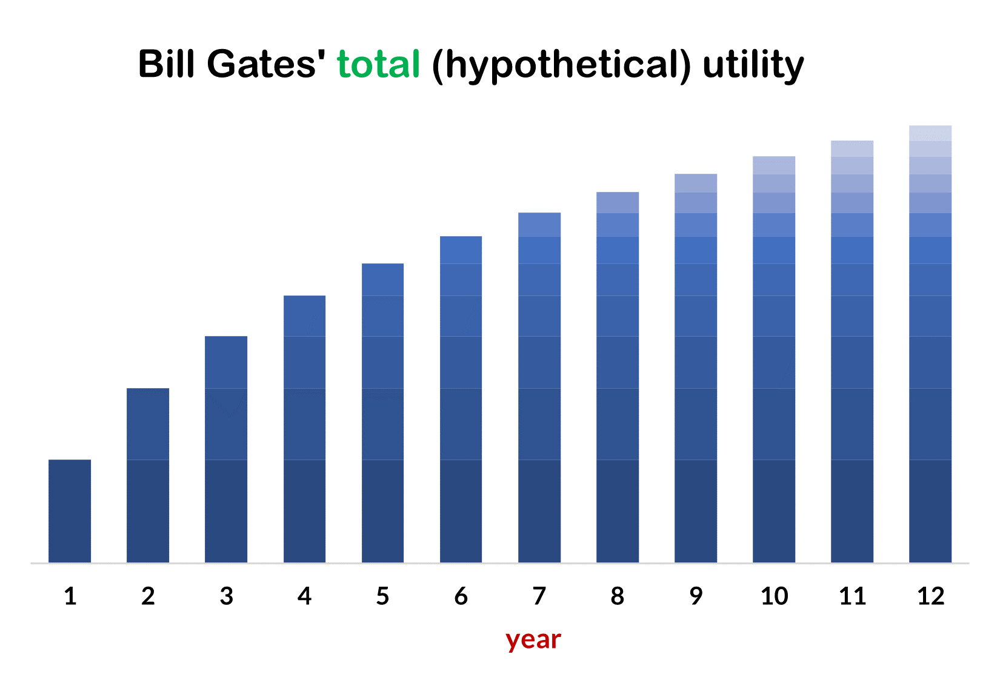

## Microeconomics and macroeconomics

The distinction between microeconomics and macroeconomics is not a perfectly clean one in practice, and we will cover some microeconomics topics in this course. The general distinction, however, is as follows. Microeconomics focuses on the decisions and actions of individual agents (i.e., individual persons or single households or individual firms). Macroeconomics, meanwhile, focuses on the economic activities of all of these actors taken together. You might think of this as 'aggregate economics' since it is the study of the aggregate: the actions and decisions of all of the individual economic agents.

Consequently, macroeconomics focuses on questions such as these: What determines how many goods and services a nation produces? What determines how many jobs are available in an economy? What determines a nation’s standard of living? What causes economic growth to speed up or slow down? What causes firms to hire more workers or to lay them off? and What causes the economy to grow over the long term?

We can track an country's macroeconomic health by examining a number of goals: the increase in the number of goods and services that are produced, the increase to the overall standard of living, and the rates of unemployment and inflation, to name the most important. 

An important part of macroeconomics is studying how macroeconomic policies implemented by the government can be used to pursue these goals. A nation's central bank conducts **monetary policy**, which involves policies that affect bank lending, interest rates, the production of goods and services, and the rates of unemployment and inflation. For the United States, the Federal Reserve pursues these policies. 

A nation's government determines **fiscal policy**, which involves adjustments to government spending and taxes. For the United States, this is done by Congress and the president. 

## Markets

A **market** is the group of buyers and sellers of a particular good or service who come together (in-person or virtually) to transact---as happens, for instance, in the Chicago housing market, the stock market, the [Starkville Community Market](https://starkville.org/things-to-do/starkville-community-market/) or the [127 Yard Sale](https://www.facebook.com/127yardsale/). In a market economy, these interactions determine how resources are used, what goods are produced, what quantities are produced, and what the prices will be.

The opposite of a market economy is a **planned** or **command economy**. In such an economy, a central authority---usually the government or, perhaps, the military---decides what goods and services will be produced and how they will be produced. It also decides what prices it will charge for goods and services, and it sets wages for workers. Currently, Cuba and North Korea have command economies.

The U.S. and other western democracies are not pure market economies. They have what are called [mixed economies](/macro/pt1a/0_intro_img/market_econ.mp4). In these countries, a significant part of the economy is a market economy, but the government still sets some economic rules, and it produces some goods itself (e.g., public education, fire and police protection, and infrastructure such as roads and bridges).

<small>video from [Investopedia](https://www.investopedia.com/)</small>

## Normative versus descriptive statements

A **descriptive statement** is one that describes some aspect of the world---or, at least, attempts to do so. Such a statement can be false, and it will still be a descriptive statement; it will just be a false one. 

A **normative statement** expresses what should or ought to be the case. Some textbooks describe normative statements as opinions, but that's not correct. 'You should not kill your next-door neighbor' is a normative statement, but it's not just a matter of opinion. It is, however, a statement that has to be justified using different methods than are used to justify or confirm descriptive statements. 

We find out if a descriptive statement is true or false by examining the world and collecting data. We can't do that for normative statements, but we can still justify them and try to decide if they are correct or not. Here are some examples of the two kinds of statements.

1. 'In 2021, the Federal budget deficit was \$2.77 trillion' is a descriptive statement.

2. 'The Federal budget deficit should be lower' is a normative statement.

3. 'You should save 15 percent of your monthly income' is a normative statement.

4. 'This Federal policy will make 12 million people better off and no one worse off' is a descriptive statement.

5. 'The government should implement a policy that will make 12 million people better off and no one worse off' is a normative statement.

As you can see from these examples, normative and descriptive statements can be related. Economics, like all sciences, is concerned with the descriptive. But, economists, understanding this science as they do, can be inclined to offer (and argue for, defend, and try to justify) normative statements.

## Marginal analysis

**Marginal**, in the sense that we will use it, has a meaning that is close to *additional*. So, a *marginal analysis* examines the cost or benefit of consuming (or producing) an additional unit of a good. A *marginal benefit* is the benefit that is added by consuming (or producing) another unit. Similarly, a *marginal cost* is the cost that is incurred by consuming or producing an additional unit.

For example, you might wonder what the benefit of one more hour of studying is. If it's your first or second hour of studying, then the benefit will be high. If it's your 30th hour of continuous studying, then the benefit will probably be low. Similarly, a firm producing cars might wonder what the cost is of manufacturing one more car. Again, it depends where on the spectrum this additional unit will occur.

**Utility**, as it is used in economics, means something like "having one's preferences satisfied," although utility is not all or nothing. Any event---eating a cookie, buying a house, going to the beach---provides some number of units of utility (including zero, and perhaps negative amounts). *Utility* is not the same as *happiness*, but *happiness* is sometimes a good substitute when thinking about how economic decisions might affect a person's utility.

To introduce the concept of **marginal utility**, let's consider a fictional example.

Imagine that when Bill Gates started Microsoft, he had \$2,000 in his personal bank account. Then, after one year, he had \$5 million. After the second year, he had \$10 million, after the third he had \$15 million, and so on for the next nine years. Each year he added \$5 million to his personal savings (except for the first, when he added \$4,998,000), and so after 12 years he had \$60 million. Now, consider these questions.

1. Just counting the happiness (or utility) that he derived from his money, which individual year do you think made him the happiest? Or otherwise stated, in which year did he achieve the greatest increase in utility?

2. Just counting the happiness (or utility) that he derived from this money, at which point do you think he was happiest? Or otherwise stated, at which point, in these 12 years, was his utility the highest?

Assuming that Bill Gates, at least in this early part of his career, is like rest of us, we would expect that the largest increase in utility occurred in the first year, when his wealth increases from \$2,000 to \$5,000,000. It is good to have \$2,000 in one's bank account. This amount will cover many unexpected expenses and temporary periods of unemployment. But having \$5,000,000 is altogether different. This is more than enough to provide many luxuries and financial stability for a lifetime. Hence, we would expect the largest increase in Bill Gates' utility during this year.

The next year's increase from $5 million to $10 million is, actually, slightly greater than the first year's increase, but probably (and for most people) the increase in happiness (or utility) would not be quite as large. Having $10 million is, generally speaking, better than having $5 million, but it probably won't positively change a person's life as much as the change from $2,000 to $5 million would. This is not to say that getting to $10 million didn't increase Bill Gates' happiness. We're just saying that it didn't increase it by as much as getting the $4,998,000 the previous year.   

Now, let's consider year 12. At the beginning of this year, our fictional Bill Gates had \$55 million. By the end of it, he has \$60 million. We would expect this additional \$5 million to increase his utility (or happiness) a bit, but by less than any of the other \$5 million increases. Having \$60 million is, presumably, better than having \$55 million, but it's not likely to change a person's well-being, happiness, or utility by much. Most of the things that you can do with \$60 million, you can already do with \$55 million.

{width=88%}

<strong>Figure 6</strong>  The utility that each additional $5,000,000 creates over 12 consecutive years. We typically expect that each additional unit of a good&mdash;in this case each additional $5,000,000&mdash;will bring a smaller amount of happiness (or utility) than the previous one.

Utility is subjective, and so the real Bill Gates's (or anyone else's) actual utility might be different, but generally speaking we would expect that the first \$5 million would cause the largest increase in utility (or happiness), the last \$5 million would cause the smallest increase, and each year in between would be lower than the previous one.

This is not to say, however, that our fictional Bill Gates was losing utility (or happiness) each year. Figure 6 (above) shows the utility created by the additional \$5 million that he acquired each year. We would expect, however, that his *total* utility (based just on this increasing wealth) to be increasing each year. This is illustrated in figure 7. But, as this this figure shows, marginal utility---that is, the additional amount of utility created by each additional \$5 million---is getting smaller each year.

{width="65%"}

<strong>Figure 7</strong>&ensp; Bill Gates' total utility is increasing, but each additional $5 million creates a smaller increase than the one before it.

The tendency for marginal utility to decrease as a person gets more and more of a good is called the **law of diminishing marginal utility**. As a person receives more of a good, the additional (or marginal) utility from each additional unit of the good declines. The first slice of pizza brings more satisfaction than the sixth; the first \$5 million brings more satisfaction than the twelfth; and so forth.

In the Bill Gates example, if we stretch it out many more years, we might expect that each additional \$5 million that he acquires will bring at least a small increase in utility, although, perhaps, at some point, the increases will become so small that they will be negligible. In other cases, however, additional units of a good might cause unhappiness or a loss of utility, in which case more of the good will cause total utility to start falling. This would be expected, for example, if someone, even if he or she loves pizza, keeps eating slices to the point of throwing up.

## Opportunity cost

The **opportunity cost** of a decision is the value of next best alternative. In other words, it is the value of what we give up when we make a choice. For example, maybe you went to the gym this morning. (And if you didn't, let's imagine that you did.) If you hadn't gone to the gym, what would you have been doing? Perhaps sleeping or studying or hanging out with friends. The opportunity cost of going to the gym is the best (or most valuable) of these other options. (But only the best one, not all of them.) 

Let's say that your second most preferred option would have spending an hour at a local coffee shop doing homework. So, the cost of going to the gym (i.e., the opportunity cost) is this hour spent at the coffee shop. Every choice, by definition, involves at least two options, and so every choice that we make has an opportunity cost.

When we purchase a good or service, the opportunity cost can often be treated as the price of whatever we purchased. For instance, if you buy a new bicycle for $700, the $700 is a measure of the other things that you could have purchased, and for practical purposes, there may be no special need to identify the alternative product or products that you would have bought with that $700 if you hadn't spent it on the bicycle. 

Sometimes, however, the price as measured in dollars may not accurately capture the true opportunity cost of a decision. This problem can loom especially large when part (or all) of the cost of an activity includes time spent doing one thing rather than another.
For instance, although attending and graduating from college is, for most people, a very important and valuable activity, attending college is costly. There are the costs of tuition, books, room and board, and other expenses. But in addition to those expenses, there are the alternative ways that a person could be using all of the time that he or she is devoting to college.
