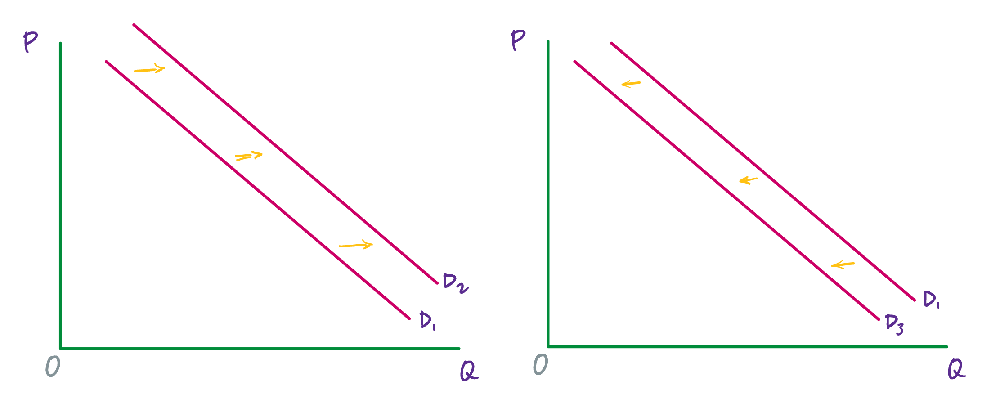
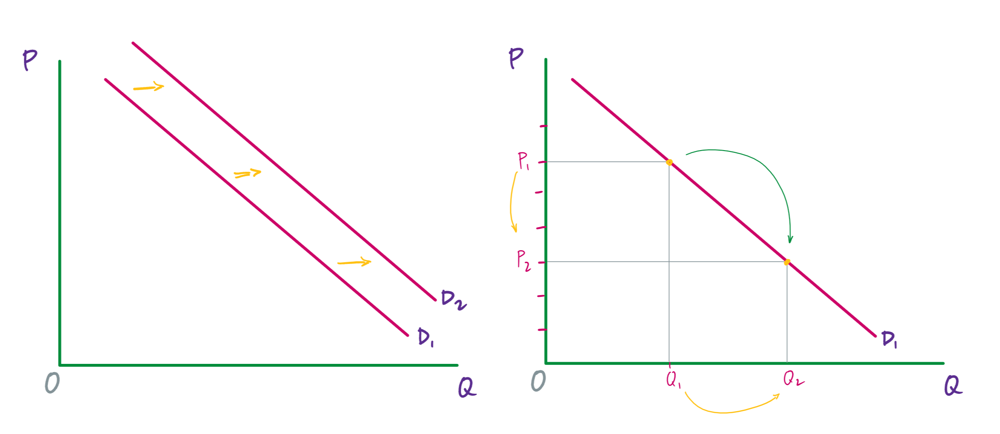

Economists use the term **demand** to refer to the amount of a good or service consumers are willing and able to purchase at each price. This is the definition:

!!! note ""

    **Demand**: A schedule (i.e., table) or curve (in a graph) that shows the various quantities of a product that consumers are willing and able to purchase at each specific price in a series of possible prices during some specified time frame.

Demand is fundamentally based on needs and wants---if you have no need or want for something, you won\'t buy it. (While a consumer may be able to differentiate between a need and a want, from an economist's perspective they are the same.) Conversely, if you do need or want some good, then you will buy it; and the more that you need or want it, the more that you will be willing to pay. 

Demand is also based on a person's ability to pay. If someone is unable to pay for a good (at any price), then, in this economic sense, he or she has no demand for it. (Of course, in a broader sense, many people need goods and services---sometimes quite urgently---for which they are unable to pay. This sense of *need*, however, is separate from the analysis of demand that we will undertake here.)

The **price** is what a buyer pays for a unit of a good or service. The total number of units that all consumers would purchase at a specific price is called the **quantity demanded**. A rise in price of a good or service almost always decreases the quantity demanded. Conversely, a drop in the price will, almost always, increase the quantity demanded. This inverse relationship between price and quantity demanded is called the **law of demand**.

For instance, when the price of a gallon of gasoline increases, people look for ways to reduce their consumption by combining several errands, commuting by carpool or mass transit, or taking weekend or vacation trips closer to home. Conversely, when the price of a gallon of gas decreases, people will tend---deliberately or not---to increase their consumption.

## An example

As is stated in the definition, demand can be represented in a schedule (i.e., a table) or as a curve (i.e., a line in a graph). Here is a (made up) demand schedule for gasoline in a medium sized country.

<table class="styled-table">
<thead>
<tr>
<th>Price</th>
<th>Quantity demanded</th>
</tr>
<tr>
<th>(per gallon)</th>
<th>(millions of gallons)</th>
</tr>
</thead>
<tbody>
<tr>
<td>$1.00</td>
<td>800</td>
</tr>
<tr>
<td>$1.20</td>
<td>700</td>
</tr>
<tr>
<td>$1.40</td>
<td>600</td>
</tr>
<tr>
<td>$1.60</td>
<td>550</td>
</tr>
<tr>
<td>$1.80</td>
<td>500</td>
</tr>
<tr>
<td>$2.00</td>
<td>460</td>
</tr>
<tr>
<td>$2.20</td>
<td>420</td>
</tr>
</tbody>
</table>

<strong>Table 1</strong>&nbsp;&nbsp;&nbsp;The demand schedule for gasoline lists the possible prices and quantity demanded at each price&mdash;in this case, per week for a medium sized country.

Every consumer in this country has his or own demand schedule---that is, the amount that they would buy each week at each price. This table represents the total amounts, at each price, that all of them would buy, which makes it the **market demand schedule**. Since we are studying *macro*-economics, we will be primarily concerned with market demand (whether represented as a schedule or a curve).

The same information can also be represented by a demand curve in a graph. Such a graph will have quantity on the horizontal axis and the price on the vertical axis. (Note that this is an exception to the normal rule in mathematics that the independent variable goes on the horizontal axis and the dependent variable goes on the vertical axis. Price is the independent variable; quantity demanded is the dependent variable.)

{width="90%"}

<strong>Figure 1</strong>&nbsp;&nbsp;&nbsp;A demand curve for gasoline has price on the vertical axis and the quantity demanded on the horizontal axis.

Demand curves will appear somewhat different for each good and service. They may be relatively steep or flat, and they may be straight or curved. But nearly all demand curves have the downward slope that reflects the law of demand: as the price increases, the quantity demanded decreases, and conversely, as the price decreases, the quantity demanded increases.

<iframe width="560" height="315" src="https://www.youtube-nocookie.com/embed/7czP-DA58s4?si=A7fZmWcgwhIxoed8" title="YouTube video player" frameborder="0" allow="accelerometer; autoplay; clipboard-write; encrypted-media; gyroscope; picture-in-picture; web-share" allowfullscreen></iframe>

<strong>Video 1</strong>

## 'Demand' versus 'quantity demanded'

*Demand* is not the same as *quantity demanded*. *Demand* is relationship between a range of prices and the quantities demanded at those prices. Thus, *demand* is represented by the (whole) demand curve or demand schedule. *Quantity demanded*, on the other hand, is a specific amount on the demand curve or in the demand schedule. It is the amount that will be demanded at a particular price.

## The *ceteris paribus* assumption

A demand curve (as well as a supply curve, as we will see) is a relationship between two, and only two, variables: quantity on the horizontal axis and price on the vertical axis. The assumption behind a demand curve is that no other relevant economic factors besides the price of the good or service, are changing. This is called the *ceteris paribus* assumption.

!!! note ""

    ***ceteris paribus***: "other things being equal." This term is used when looking at the relationship between two or three variables to indicate that we are assuming that everything else (besides those variables) is not changing---at least for some window of time.

## Factors that shift demand

Now, we will consider the factors that cause demand to change. Keep in mind that *demand* refers to the whole curve, and so these are factors that, *for every price*, increase or decrease the quantity demanded. In a graph, this change will be reflected by the demand curve moving to left when demand decreases, or to the right when demand increases.

{width="100%"}

<strong>Figure 2</strong>&nbsp;&nbsp;&nbsp;An increase in demand is represented by the demand curve moving to the right (first graph). A decrease to demand is represented by the demand curve moving the left (second graph).

### Changes in tastes and preferences

According to the U.S. Department of Agriculture (USDA), from 1980 to 2021, the per-person consumption of chicken by Americans rose from 47 pounds per year to 97 pounds per year, and consumption of beef fell from 76 pounds per year to 59 pounds per year. Changes like these are largely due to changes to consumers' taste or preference for a good.

An increase in demand, as we see for chicken over the past four decades, means that, at every price, consumers demand more of the good. (Or equivalently, at every quantity, consumers are willing to pay more for each unit of the good.) This is reflected in the graph by the demand curve shifting to the right.

A decrease in demand, as we see for beef over the past four decades, means that, at every price, consumers demand less of the good. (Or equivalently, at every quantity, consumers are not willing to pay as much for each unit of the good.) This is reflected in the graph by the demand curve shifting to the left.

### A change to the number of consumers

As the number of consumers for a good or service increases, demand for that good or service increases. And as the number of consumers decreases, demand decreases.

A standard example is the proportion of elderly citizens in the United States (and in many developed countries). This part of the population rose from 9.8% in 1970 to 12.6% in 2000, and it is projected by the U.S. Census Bureau to be 20% of the entire U.S. population by 2030. Whereas a society with relatively more children, like the United States in the 1960s, will have greater demand for toys, sports equipment, and day care facilities, a society with relatively more elderly persons, as the United States is projected to have by 2030, will have a higher demand for nursing homes and healthcare.

### Changing expectations about future prices

The current price for a good or service affects the quantity demanded (as the law of demand tells us), but expectations about future prices also affect demand. If consumers expect that the price of a good will rise in the future, then this expectation will increase current demand, pushing the demand curve to the right. Conversely, if consumers expect that the price of a good will fall in the future, then this will decrease current demand, moving the demand curve to the left.

### A change to the income of consumers

The final two factors that affect demand---a change to incomes and a change to the price of related goods---are a little more complicated. For both, multiple steps must be taken to determine how demand will be affected.   

Consider for a moment what might happen to demand for instant ramen noodles as income increases for all (or most) members of a population---if, for instance, there is an economic boom and wages rise for almost everyone. Or imagine what will happen to demand for instant ramen if income decreases for all (or most) members of a population---if, say, there is a severe recession.

Instant ramen is an example of an **inferior good**. This is a good for which, as incomes rise, demand decreases; and, as incomes fall, demand increases. Other examples of inferior goods are generic brand groceries, used cars, hot dogs, and McDonalds coffee. For inferior goods, when incomes increase, demand decreases---and so the demand curve shifts to the left. (And the opposite happens when incomes decrease.)

Most goods, however, are not inferior goods. They are what we call **normal goods**. Normal goods are products for which, as incomes increase, demand increases; and as incomes decrease, demand decreases. Gasoline, an example that we've already discussed, is a normal good. As incomes increase, demand for gasoline increases. And the opposite happens when incomes decrease.

### A change to the price of related goods

Here, we, again, have two categories.

!!! note ""

    Two goods are **substitutes** when one can be substituted for the other. So, for example, Coke and Pepsi are substitutes.
    
    Two goods are **complements** when they are typically consumed together. For example, cars and car insurance or golf clubs and golf balls are complements.

Now, think about (*a*) what happens to demand for Pepsi when the price of Coke increases (or decreases)? And (*b*) what happens to demand for golf balls as the price of golf clubs increases (or decreases)?

!!! note ""

    For two **substitutes**, *x* and *y*, when the price of *x* increases, the **quantity demanded** of *x* goes down and **demand** for *y* increases. (And vice versa when the price of *x* decreases.)
    
    For two **complements**, *w* and *z*, when the price of *w* increases, the **quantity demanded** of *w* goes down and the **demand** for *z* goes down. (And vice versa when the price of *w* decreases.)

Some care is required here because, for both substitutes and complements, we have a change to the *quantity demanded* and a change to *demand*.

<iframe width="560" height="315" src="https://www.youtube-nocookie.com/embed/_AOdCq30e4o?si=HhS5fzs15U5yp6QE" title="YouTube video player" frameborder="0" allow="accelerometer; autoplay; clipboard-write; encrypted-media; gyroscope; picture-in-picture; web-share" allowfullscreen></iframe>

<strong>Video 1</strong>

## 'Shifts in demand' versus 'shifts in quantity demanded'

In an analysis of demand, there are two kinds of changes: (1) a change from one point on a demand curve to another point on that demand curve, and (2) a shift of the whole demand curve to the left or to the right.

The first one---a change from one point on a demand curve to another point---is caused by a change in price. If the price of a good or service increases, then we move up the demand curve---and we get a new, lower quantity demanded. If the price of a good or service decreases, then we move down the demand curve---and we have a new, higher quantity demanded.

The second one---shifts of the whole demand curve to the left or the right---is caused by a change to one of the factors that we just examined: tastes and preferences, the number of consumers, expectations about future prices, incomes, or the price of related goods.

The way to keep these two types of changes separate is to notice that we can change price right on the graph. We just move up or down the vertical axis. And when we do this, we are going to move up or down the demand curve, which will designate a lower or higher value on the horizontal axis.

{width="100%"}

<strong>Figure 3</strong>&nbsp;&nbsp;A change to demand is caused by one of the factors affecting demand (e.g., changes to tastes or preferences, etc.). This change will be represented by the demand curve shifting the the left or to the right (first graph). A change to the quantity demanded is caused by a change to the price of the good (second graph).

In contrast, when there is a change to tastes and preferences, the number of consumers, expectations about future prices, incomes, or the price of related goods, there is no way to register this change on the graph. For instance, if consumer preferences change such that mom jeans suddenly become more popular, there is no "popularity of mom jeans" variable on the graph that we can adjust. That change is happening "off stage," so to speak. In this case, we have to update our whole graph by moving the demand curve (either to the left or to the right).

<iframe width="560" height="315" src="https://www.youtube-nocookie.com/embed/toacnxj4Nmg?si=ODWbP8_Y2WaDwEdE" title="YouTube video player" frameborder="0" allow="accelerometer; autoplay; clipboard-write; encrypted-media; gyroscope; picture-in-picture; web-share" allowfullscreen></iframe>

<iframe width="560" height="315" src="https://www.youtube-nocookie.com/embed/TQ4WCx8daDk?si=Kz5fwS1v88aiKnew" title="YouTube video player" frameborder="0" allow="accelerometer; autoplay; clipboard-write; encrypted-media; gyroscope; picture-in-picture; web-share" allowfullscreen></iframe>

<strong>Videos 3 & 4</strong>

